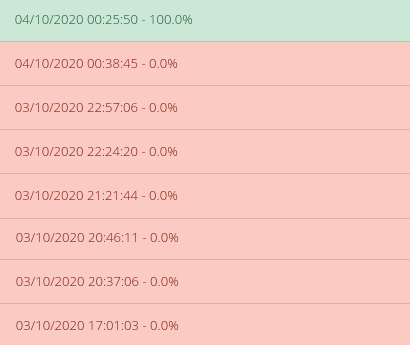

# Taller de Programación I - Cátedra Veiga - FIUBA
# Trabajo Práctico 0

<h2 align="right">Jonathan David Rosenblatt</h2>
<h2 align="right">104105</h2>

## Introducción

Este es el primer trabajo de la materia Taller de Programación I. Tiene como objetivo nivelar los conocimientos de C y familiarizarnos con la plataforma de registros y corrección automática de trabajos SERCOM. En el siguiente se explicarán tanto las preguntas planteadas en la consigna, como el código dado y las salidas del SERCOM al interactuar con este. En cada paso se explicará la evolución de los archivos dados por la cátedra con la finalidad de acostumbrarse al sistema de entregas y a la dinámica del curso. 

## PASO 0: Entorno de Trabajo

### a) Output del programa "main.c" sin y con valgrind respectivamente. 

```
niyoζ:~/Taller-de-Programación-I/TP0-9508$ gcc main.c -o tp
niyoζ:~/Taller-de-Programación-I/TP0-9508$ ./tp
Hola mundo!
niyoζ:~/Taller-de-Programación-I/TP0-9508$ valgrind ./tp
==7545== Memcheck, a memory error detector
==7545== Copyright (C) 2002-2017, and GNU GPL'd, by Julian Seward et al.
==7545== Using Valgrind-3.15.0 and LibVEX; rerun with -h for copyright info
==7545== Command: ./tp
==7545==
Hola mundo!
==7545==
==7545== HEAP SUMMARY:
==7545==     in use at exit: 0 bytes in 0 blocks
==7545==   total heap usage: 1 allocs, 1 frees, 1,024 bytes allocated
==7545==
==7545== All heap blocks were freed -- no leaks are possible
==7545==
==7545== For lists of detected and suppressed errors, rerun with: -s
==7545== ERROR SUMMARY: 0 errors from 0 contexts (suppressed: 0 from 0)
```

### b) Utilidades de Valgrind y opciones más comunes.

***Valgrind*** es un software cuya finalidad está mayoritariamente en facilitar el debugging de un programa, permitiéndote saber cuando tenés pérdidas de memoria en tu código o rastrear facilmente variables no inicializadas, entre otros casos.

Un típico ejemplo donde ***Valgrind*** puede ser muy útil, es cuando usamos memoria dinámica y nos estamos olvidando de liberarla. Si tuvieramos fugas de memoria en el heap, esto estaría indicado en lo que vemos por salida estándar.

En el ejemplo antes dado vemos el mensaje ```All heap blocks were freed -- no leaks are possible``` lo que significa que no estamos dejando memoria en el heap sin liberar.

Las opciones más comunes de este son:
- ```--leak-check=full``` especifica por la salida estándar del programa todas las pérdidas de memoria que haya tenido el programa
- ```--track-origins=yes``` muestra el origen de las variables no inicializadas
- ```--track-fds=yes``` muestra que archivos quedaron abiertos
- ```--show-reachable=yes``` muestra que bloques de memoria no liberados aun son alcanzables.  

### c) Función ***sizeof()***

La función ***sizeof()*** recibe una variable y devuelve el tamaño del mismo en bytes. El valor que devuelve depende de cada arquitectura. En el caso de ***sizeof(char)*** el resultado es 1 ya que codificamos todo caracter con 8 bits y luego ***sizeof(int)*** es 4. Pero en casos como ***sizeof(void*)*** puede ocurrir que si estamos en una arquitectura de 32 bits el resultado sea 4 y en 64 bits el resultado sea 8 (es decir, la cantidad de bits necesarios para representar un puntero cambió entre arquitecturas). 

### d) ***Sizeof() meets structs***

Sea el siguiente ejemplo de código en C en una arquitectura x86 de 64 bits:

```
struct tp0{
	char c;
	void* ptr;
};
``` 

Si tomamos ```sizeof(struct tp0)``` veremos que el resultado será de 16. Esto es ya que el offset del ```char c``` es de 0 y ocupa 1 byte, haciendo que ```void* ptr``` tenga que empezar con offset 1 en el struct, pero esto no ocurre ya que esta posición de memoria no sería múltiplo de su tamaño (es decir, no es múltiplo de 8). En consecuencia el compilador agrega 7 bytes extras entre los elementos del struct). Demostrando así que el valor esperado no es ```sizeof(char) + sizeof(void*)```. 

Queda entonces demostrado que no siempre ocurre que el ```sizeof(struct s)``` es igual al ```sizeof(s1) + sizeof(s2) + ... + sizeof(sn) ``` (es decir, a la suma de sus elementos). Esto ocurre por el padding.

### e) STDIN, STDOUT y STDERR

Estos 3 archivos son la entrada estándar de datos, salida estándar de datos y salida de errores respectivamente.Son archivos que, dentro de los sistemas operativos UNIX, permanecen abiertos por cada proceso para comunicar información, ya sea entre procesos o hacia el usuario. 

También se puede concatenar estas salidas y entradas. Por ejemplo, si ejecuto en la términal ```ls > archivos.txt``` estaría escribiendo en mi archivo ***archivos.txt*** un listado de todos los documentos, programas y directorios que tenga almacenado en mi posición actual. Si en cambio ejecuto ```cat < archivos.txt``` estaría haciendo que el ejecutable de la izquiera reciba una lista de archivos por stdin y finalmente los imprima. También tengo al pipe que concatena el stdout del ejecutable izquierdo con el stdin del ejecutable del lado derecho del mismo. Por ejemplo si ejecuto ```cat archivos.txt | grep .txt ``` estaría conectando lo que lanza por stdout el término izquierdo (que sería una lista de los documentos del directorio donde estoy parado) al stdin del término derecho (que recibe mi lista de documentos y escribe por stdout los que tienen ".txt" en el nombre).

## PASO 1

#### Desempaquetando y compilando el codigo...

```
Descomprimiendo el codigo 'source_unsafe.zip'...
Archive:  source_unsafe.zip
  inflating: source_unsafe/paso1_main.c
  inflating: source_unsafe/paso1_wordscounter.c
  inflating: source_unsafe/paso1_wordscounter.h
Compilando el codigo...
  CC  paso1_main.o
paso1_main.c: In function ‘main’:
paso1_main.c:22:9: error: unknown type name ‘wordscounter_t’
   22 |         wordscounter_t counter;
      |         ^~~~~~~~~~~~~~
paso1_main.c:23:9: error: implicit declaration of function ‘wordscounter_create’ [-Wimplicit-function-declaration]
   23 |         wordscounter_create(&counter);
      |         ^~~~~~~~~~~~~~~~~~~
paso1_main.c:24:9: error: implicit declaration of function ‘wordscounter_process’ [-Wimplicit-function-declaration]
   24 |         wordscounter_process(&counter, input);
      |         ^~~~~~~~~~~~~~~~~~~~
paso1_main.c:25:24: error: implicit declaration of function ‘wordscounter_get_words’ [-Wimplicit-function-declaration]
   25 |         size_t words = wordscounter_get_words(&counter);
      |                        ^~~~~~~~~~~~~~~~~~~~~~
paso1_main.c:27:9: error: implicit declaration of function ‘wordscounter_destroy’ [-Wimplicit-function-declaration]
   27 |         wordscounter_destroy(&counter);
      |         ^~~~~~~~~~~~~~~~~~~~
make: *** [<builtin>: paso1_main.o] Error 1

real    0m0.032s
user    0m0.019s
sys     0m0.005s
[Error] Fallo la compilacion del codigo en 'source_unsafe.zip'. Codigo de error 2
```

Aquí la función main está intentando usar tipos no declarados y genera un error de compilación. Todas estas declaraciones faltantes se encuentran en el archivo ```paso1_wordscounter.h```. Es por eso que en la linea 22 el compilador no reconoce el tipo y en las lineas 23, 24, 25 y 27 no se reconocen las llamadas a las funciones no incluidas. 

#### Verificando el codigo...

```
/task/student//source_unsafe/paso1_wordscounter.c:27:  Missing space before ( in while(  [whitespace/parens] [5]
/task/student//source_unsafe/paso1_wordscounter.c:41:  Mismatching spaces inside () in if  [whitespace/parens] [5]
/task/student//source_unsafe/paso1_wordscounter.c:41:  Should have zero or one spaces inside ( and ) in if  [whitespace/parens] [5]
/task/student//source_unsafe/paso1_wordscounter.c:47:  An else should appear on the same line as the preceding }  [whitespace/newline] [4]
/task/student//source_unsafe/paso1_wordscounter.c:47:  If an else has a brace on one side, it should have it on both  [readability/braces] [5]
/task/student//source_unsafe/paso1_wordscounter.c:48:  Missing space before ( in if(  [whitespace/parens] [5]
/task/student//source_unsafe/paso1_wordscounter.c:53:  Extra space before last semicolon. If this should be an empty statement, use {} instead.  [whitespace/semicolon] [5]
/task/student//source_unsafe/paso1_wordscounter.h:5:  Lines should be <= 80 characters long  [whitespace/line_length] [2]
/task/student//source_unsafe/paso1_main.c:12:  Almost always, snprintf is better than strcpy  [runtime/printf] [4]
/task/student//source_unsafe/paso1_main.c:15:  An else should appear on the same line as the preceding }  [whitespace/newline] [4]
/task/student//source_unsafe/paso1_main.c:15:  If an else has a brace on one side, it should have it on both  [readability/braces] [5]
Done processing /task/student//source_unsafe/paso1_wordscounter.c
Done processing /task/student//source_unsafe/paso1_wordscounter.h
Done processing /task/student//source_unsafe/paso1_main.c
Total errors found: 11
```

Yendo en orden comentaré los 11 errores mencionados: 
- Dentro del archivo ```paso1_wordscounter.c```, linea 27, no se está dejando un espacio entre el while y su condición. 
- Luego, en el if de la linea 41 hay 2 espacios extras del lado izquierdo. Dentro de la misma linea ocurre que solamente puede haber hasta un espacio (continuo) dentro de la condición. 
- En la línea 47 no ocurre que el else if arranca donde la condición anterior termina, sino que se va una línea para abajo; las llaves deberían estar en la misma línea.
- En la línea 48 no hay un espacio entre el paréntesis y el if.
- En la línea 53 hay un espacio extra entre el "next_state" y el punto y coma. 
- Luego en el archivo ```paso1_wordscounter.h``` se advierte que las líneas no deben tener más de 80 caracteres. 
- Finalmente en ```paso1_main.c``` ocurre que en la línea 12 se está usando la función insegura ```strcpy()``` y recomienda usar snprintf (como se dijo en clase, strcpy es insegura ya que no sabe que tamaño tiene el buffer de destino, cosa que puede hacer que pisemos memoria que no nos corresponde). 
- Finalmente en la línea 15 vemos que el else debería empezar donde termina la llave anterior y que las llaves deberían estar en la misma línea. 

#### Finalizando...

```
El despaquetado y/o compilacion finalizo con un codigo de error (1). Tendras que arreglar esto antes de poder continuar.
```

El Makefile que se usa para este proyecto tiene los flags: ```CFLAGS = -Wall -Werror -pedantic -pedantic-errors``` y particularmente el flag ```-Werror``` ***transforma todos los warnings en errors.***

## PASO 2

#### Desempaquetando y compilando el codigo...

```
Descomprimiendo el codigo 'source_unsafe.zip'...
Archive:  source_unsafe.zip
  inflating: source_unsafe/paso2_main.c
  inflating: source_unsafe/paso2_wordscounter.c
  inflating: source_unsafe/paso2_wordscounter.h
  inflating: source_unsafe/README.md
Compilando el codigo...
  CC  paso2_wordscounter.o
In file included from paso2_wordscounter.c:1:
paso2_wordscounter.h:7:5: error: unknown type name ‘size_t’
    7 |     size_t words;
      |     ^~~~~~
paso2_wordscounter.h:20:1: error: unknown type name ‘size_t’
   20 | size_t wordscounter_get_words(wordscounter_t *self);
      | ^~~~~~
paso2_wordscounter.h:1:1: note: ‘size_t’ is defined in header ‘<stddef.h>’; did you forget to ‘#include <stddef.h>’?
  +++ |+#include <stddef.h>
    1 | #ifndef __WORDSCOUNTER_H__
paso2_wordscounter.h:25:49: error: unknown type name ‘FILE’
   25 | void wordscounter_process(wordscounter_t *self, FILE *text_file);
      |                                                 ^~~~
paso2_wordscounter.h:1:1: note: ‘FILE’ is defined in header ‘<stdio.h>’; did you forget to ‘#include <stdio.h>’?
  +++ |+#include <stdio.h>
    1 | #ifndef __WORDSCOUNTER_H__
paso2_wordscounter.c:17:8: error: conflicting types for ‘wordscounter_get_words’
   17 | size_t wordscounter_get_words(wordscounter_t *self) {
      |        ^~~~~~~~~~~~~~~~~~~~~~
In file included from paso2_wordscounter.c:1:
paso2_wordscounter.h:20:8: note: previous declaration of ‘wordscounter_get_words’ was here
   20 | size_t wordscounter_get_words(wordscounter_t *self);
      |        ^~~~~~~~~~~~~~~~~~~~~~
paso2_wordscounter.c: In function ‘wordscounter_next_state’:
paso2_wordscounter.c:30:25: error: implicit declaration of function ‘malloc’ [-Wimplicit-function-declaration]
   30 |     char* delim_words = malloc(7 * sizeof(char));
      |                         ^~~~~~
paso2_wordscounter.c:30:25: error: incompatible implicit declaration of built-in function ‘malloc’ [-Werror]
paso2_wordscounter.c:5:1: note: include ‘<stdlib.h>’ or provide a declaration of ‘malloc’
    4 | #include <stdbool.h>
  +++ |+#include <stdlib.h>
    5 |
cc1: all warnings being treated as errors
make: *** [<builtin>: paso2_wordscounter.o] Error 1

real    0m0.034s
user    0m0.021s
sys     0m0.012s
[Error] Fallo la compilacion del codigo en 'source_unsafe.zip'. Codigo de error 2
```

El paso 2 sigue generando errores de compilación:

- En el archivo ```paso2_wordscounter.h``` (lineas 7 y 20) se quiere usar el tipo ```size_t``` sin incluir su definición en ```<stddef.h>```.
- Dentro del mismo archivo, en la línea 25 que se se quiere apuntar a una variable de tipo ```FILE``` sin incluir su definición en ```<stdio.h>```.
- En el archivo ```paso2_wordscounter.c``` la función ```wordscounter_get_words``` piensa que el tipo de dato que devuelve no es el mismo que está declarado en el header. Esto ocurre ya que no se define ```size_t```.
- Finalmente en la línea 30 del mismo archivo se está llamando a ```malloc``` sin incluir su definición en ```<stdlib.h>```.

#### Verificando el codigo...

```
Done processing /task/student//source_unsafe/paso2_wordscounter.c
Done processing /task/student//source_unsafe/paso2_main.c
Done processing /task/student//source_unsafe/paso2_wordscounter.h
```

```
niyoζ:~/Taller de Programación I/TP0-9508$ diff paso1_main.c paso2_main.c || diff paso1_wordscounter.c paso2_wordscounter.c || diff paso1_wordscounter.h paso2_wordscounter.h
3a4
\> #include "paso2_wordscounter.h"
12c13
<         strcpy(filepath, argv[1]);
\---
\>         memcpy(filepath, argv[1], strlen(argv[1]) + 1);
14,15c15
<     }
<     else {
\---
\>     } else {
0a1
\> #include "paso2_wordscounter.h"
4d4
< #include "paso1_wordscounter.h"
13,14c13
< void wordscounter_create(wordscounter_t *self)
< {
\---
\> void wordscounter_create(wordscounter_t *self) {
27c26
<     } while(state != STATE_FINISHED);
\---
\>     } while (state != STATE_FINISHED);
41c40
<     if (  c == EOF) {
\---
\>     if (c == EOF) {
46,48c45,46
<     }
<     else if (state == STATE_IN_WORD) {
<         if(strchr(delim_words, c) != NULL) {
\---
\>     } else if (state == STATE_IN_WORD) {
\>         if (strchr(delim_words, c) != NULL) {
53c51
<     return next_state ;
\---
\>     return next_state;
5c5
< // Tipo wordscounter_t: almacena la cantidad de palabras procesadas de un archivo.
\---
\> // Tipo wordscounter_t: procesa cantidad de palabras dentro de un archivo.
```
Vemos con estos diff, que del paso1 al paso2, se eliminaron todos los errores generados en esta sección del output del SERCOM. Ya no se usan funciones inseguras y la sintaxis fue arreglada.     

#### Finalizando...

```
El despaquetado y/o compilacion finalizo con un codigo de error (1). Tendras que arreglar esto antes de poder continuar.
```

## PASO 3

#### Desempaquetando y compilando el codigo...

```
Descomprimiendo el codigo 'source_unsafe.zip'...
Archive:  source_unsafe.zip
  inflating: source_unsafe/README.md
  inflating: source_unsafe/paso3_main.c
  inflating: source_unsafe/paso3_wordscounter.c
  inflating: source_unsafe/paso3_wordscounter.h
Compilando el codigo...
  CC  paso3_wordscounter.o
  CC  paso3_main.o
  LD  tp
/usr/bin/ld: paso3_main.o: in function `main':
/task/student/source_unsafe/paso3_main.c:27: undefined reference to `wordscounter_destroy'
collect2: error: ld returned 1 exit status
make: *** [/task/student/MakefileTP0:142: tp] Error 1

real    0m0.178s
user    0m0.123s
sys     0m0.050s
[Error] Fallo la compilacion del codigo en 'source_unsafe.zip'. Codigo de error 2
```

El error es de enlazamiento ya que este ocurre cuando se intenta generar el ejecutable. Cuando main intenta usar el ```wordscounter_destroy``` se encuentra con una función declarada pero sin comportamiento definido. Esto ocurre ya que el compilador asume que toda función declarada está definida en algún lugar, y la búsqueda del código que define el comportamiento es tarea del enlazador. 

#### Verificando el codigo...

```
Done processing /task/student//source_unsafe/paso3_main.c
Done processing /task/student//source_unsafe/paso3_wordscounter.c
Done processing /task/student//source_unsafe/paso3_wordscounter.h
```

#### Finalizando...

```
El despaquetado y/o compilacion finalizo con un codigo de error (1). Tendras que arreglar esto antes de poder continuar.
```

Además notamos que todos los includes necesarios son puestos en código para esta iteración del proyecto.

```
niyoζ:~/Taller de Programación I/TP0-9508$ diff paso2_main.c paso3_main.c || diff paso2_wordscounter.c paso3_wordscounter.c || diff paso2_wordscounter.h paso3_wordscounter.h
4c4
< #include "paso2_wordscounter.h"
\---
\> #include "paso3_wordscounter.h"
1c1
< #include "paso2_wordscounter.h"
\---
\> #include "paso3_wordscounter.h"
4a5
\> #include <stdlib.h>
3a4,5
\> #include <string.h>
\> #include <stdio.h>
```

## PASO 4

Vemos en esta iteración del proyecto que se actualizan los includes y se le agrega funcionalidad nula al ```wordscounter_destroy```. Esto va a hacer que no podamos liberar los datos que se fueron guardando en el heap.

```
niyoζ:~/Taller de Programación I/TP0-9508$ diff paso3_main.c paso4_main.c || diff paso3_wordscounter.c paso4_wordscounter.c || diff paso3_wordscounter.h paso4_wordscounter.h
4c4
< #include "paso3_wordscounter.h"
\---
\> #include "paso4_wordscounter.h"
1c1
< #include "paso3_wordscounter.h"
\---
\> #include "paso4_wordscounter.h"
15a16,19
\> }
\>
\> void wordscounter_destroy(wordscounter_t *self) {
\>     //do nothing
```

#### Errores

```
==00:00:00:00.000 59== Memcheck, a memory error detector
==00:00:00:00.000 59== Copyright (C) 2002-2017, and GNU GPL'd, by Julian Seward et al.
==00:00:00:00.000 59== Using Valgrind-3.15.0 and LibVEX; rerun with -h for copyright info
==00:00:00:00.000 59== Command: ./tp input_tda.txt
==00:00:00:00.000 59== Parent PID: 58
==00:00:00:00.000 59==
==00:00:00:00.953 59==
==00:00:00:00.953 59== FILE DESCRIPTORS: 5 open at exit.
==00:00:00:00.953 59== Open file descriptor 4: input_tda.txt
==00:00:00:00.953 59==    at 0x495FEAB: open (open64.c:48)
==00:00:00:00.953 59==    by 0x48E2195: _IO_file_open (fileops.c:189)
==00:00:00:00.953 59==    by 0x48E2459: _IO_file_fopen@@GLIBC_2.2.5 (fileops.c:281)
==00:00:00:00.953 59==    by 0x48D4B0D: __fopen_internal (iofopen.c:75)
==00:00:00:00.954 59==    by 0x48D4B0D: fopen@@GLIBC_2.2.5 (iofopen.c:86)
==00:00:00:00.954 59==    by 0x109177: main (paso4_main.c:14)
==00:00:00:00.954 59==
==00:00:00:00.954 59== Open file descriptor 3: /task/student/cases/tda/__valgrind__
==00:00:00:00.954 59==    <inherited from parent>
==00:00:00:00.954 59==
==00:00:00:00.954 59== Open file descriptor 2: /task/student/cases/tda/__stderr__
==00:00:00:00.954 59==    <inherited from parent>
==00:00:00:00.954 59==
==00:00:00:00.954 59== Open file descriptor 1: /task/student/cases/tda/__stdout__
==00:00:00:00.954 59==    <inherited from parent>
==00:00:00:00.954 59==
==00:00:00:00.954 59== Open file descriptor 0: /task/student/cases/tda/__stdin__
==00:00:00:00.954 59==    <inherited from parent>
==00:00:00:00.954 59==
==00:00:00:00.954 59==
==00:00:00:00.954 59== HEAP SUMMARY:
==00:00:00:00.954 59==     in use at exit: 1,977 bytes in 216 blocks
==00:00:00:00.954 59==   total heap usage: 218 allocs, 2 frees, 10,169 bytes allocated
==00:00:00:00.954 59==
==00:00:00:00.954 59== 472 bytes in 1 blocks are still reachable in loss record 1 of 2
==00:00:00:00.954 59==    at 0x483B7F3: malloc (in /usr/lib/x86_64-linux-gnu/valgrind/vgpreload_memcheck-amd64-linux.so)
==00:00:00:00.954 59==    by 0x48D4AAD: __fopen_internal (iofopen.c:65)
==00:00:00:00.954 59==    by 0x48D4AAD: fopen@@GLIBC_2.2.5 (iofopen.c:86)
==00:00:00:00.954 59==    by 0x109177: main (paso4_main.c:14)
==00:00:00:00.954 59==
==00:00:00:00.954 59== 1,505 bytes in 215 blocks are definitely lost in loss record 2 of 2
==00:00:00:00.954 59==    at 0x483B7F3: malloc (in /usr/lib/x86_64-linux-gnu/valgrind/vgpreload_memcheck-amd64-linux.so)
==00:00:00:00.954 59==    by 0x109301: wordscounter_next_state (paso4_wordscounter.c:35)
==00:00:00:00.954 59==    by 0x1093B5: wordscounter_process (paso4_wordscounter.c:30)
==00:00:00:00.954 59==    by 0x109197: main (paso4_main.c:24)
==00:00:00:00.954 59==
==00:00:00:00.954 59== LEAK SUMMARY:
==00:00:00:00.954 59==    definitely lost: 1,505 bytes in 215 blocks
==00:00:00:00.954 59==    indirectly lost: 0 bytes in 0 blocks
==00:00:00:00.954 59==      possibly lost: 0 bytes in 0 blocks
==00:00:00:00.954 59==    still reachable: 472 bytes in 1 blocks
==00:00:00:00.954 59==         suppressed: 0 bytes in 0 blocks
==00:00:00:00.954 59==
==00:00:00:00.954 59== For lists of detected and suppressed errors, rerun with: -s
==00:00:00:00.954 59== ERROR SUMMARY: 1 errors from 1 contexts (suppressed: 0 from 0)
```

Los errores del ***tda test*** son:
- En la línea 14 de ```paso4_main.c``` se abre un archivo y no se cierra. 
- En la línea 35 de ```paso4_wordscounter.c``` no se está liberando la memoria que se pide. 

```
==00:00:00:00.000 47== Memcheck, a memory error detector
==00:00:00:00.000 47== Copyright (C) 2002-2017, and GNU GPL'd, by Julian Seward et al.
==00:00:00:00.000 47== Using Valgrind-3.15.0 and LibVEX; rerun with -h for copyright info
==00:00:00:00.000 47== Command: ./tp input_extremely_long_filename.txt
==00:00:00:00.000 47== Parent PID: 46
==00:00:00:00.000 47==
**00:00:00:00.843 47** *** memcpy_chk: buffer overflow detected ***: program terminated
==00:00:00:00.843 47==    at 0x483E9CC: ??? (in /usr/lib/x86_64-linux-gnu/valgrind/vgpreload_memcheck-amd64-linux.so)
==00:00:00:00.843 47==    by 0x4843C0A: __memcpy_chk (in /usr/lib/x86_64-linux-gnu/valgrind/vgpreload_memcheck-amd64-linux.so)
==00:00:00:00.843 47==    by 0x109168: memcpy (string_fortified.h:34)
==00:00:00:00.843 47==    by 0x109168: main (paso4_main.c:13)
==00:00:00:00.868 47==
==00:00:00:00.868 47== FILE DESCRIPTORS: 4 open at exit.
==00:00:00:00.868 47== Open file descriptor 3: /task/student/cases/nombre_largo/__valgrind__
==00:00:00:00.868 47==    <inherited from parent>
==00:00:00:00.868 47==
==00:00:00:00.868 47== Open file descriptor 2: /task/student/cases/nombre_largo/__stderr__
==00:00:00:00.868 47==    <inherited from parent>
==00:00:00:00.868 47==
==00:00:00:00.868 47== Open file descriptor 1: /task/student/cases/nombre_largo/__stdout__
==00:00:00:00.868 47==    <inherited from parent>
==00:00:00:00.868 47==
==00:00:00:00.868 47== Open file descriptor 0: /task/student/cases/nombre_largo/__stdin__
==00:00:00:00.868 47==    <inherited from parent>
==00:00:00:00.868 47==
==00:00:00:00.868 47==
==00:00:00:00.868 47== HEAP SUMMARY:
==00:00:00:00.869 47==     in use at exit: 0 bytes in 0 blocks
==00:00:00:00.869 47==   total heap usage: 0 allocs, 0 frees, 0 bytes allocated
==00:00:00:00.869 47==
==00:00:00:00.869 47== All heap blocks were freed -- no leaks are possible
==00:00:00:00.869 47==
==00:00:00:00.869 47== For lists of detected and suppressed errors, rerun with: -s
==00:00:00:00.869 47== ERROR SUMMARY: 0 errors from 0 contexts (suppressed: 0 from 0)
```

En ***long filename test*** ocurre:
- Buffer Overflow en la línea 13, dentro de la función main, que ocurre ṕor estar intentando poner una ruta de archivo de más de 30 caracteres.  Si se hubiera usado ***strncpy*** en cambio, no habría overflow en el buffer ya que se puede evitar escribir más de 30 bytes (pero tampoco se podrían acceder a archivos con rutas que no cumplan con este requisito de tamaño máximo).

#### Segmentation Fault y Buffer Overflows 

Estos son dos tipos de errores son muy comunes. Un ***segmentation fault*** ocurre cuando intentamos leer o acceder a memoria que no nos pertenece. En cambio, el ***buffer overflow*** ocurre cuando intentamos escribir más bytes de lo que nuestra variable soporta y terminamos corrompiendo memoria que no nos pertenece.

## PASO 5

```
niyoζ:~/Taller de Programación I/TP0-9508$ diff paso4_main.c paso5_main.c || diff paso4_wordscounter.c paso5_wordscounter.c || diff paso4_wordscounter.h paso5_wordscounter.h
4c4
< #include "paso4_wordscounter.h"
\---
\> #include "paso5_wordscounter.h"
12,14c12
<         char filepath[30];
<         memcpy(filepath, argv[1], strlen(argv[1]) + 1);
<         input = fopen(filepath, "r");
\---
\>         input = fopen(argv[1], "r");
27a26,27
\>         if (input != stdin)
\>             fclose(input);
1c1
< #include "paso4_wordscounter.h"
\---
\> #include "paso5_wordscounter.h"
35,42c35
<     char* delim_words = malloc(7 * sizeof(char));
<     delim_words[0] = ' ';
<     delim_words[1] = ',';
<     delim_words[2] = '.';
<     delim_words[3] = ';';
<     delim_words[4] = ':';
<     delim_words[5] = '\n';
<     delim_words[6] = '\0';
\---
\>     const char* delim_words = " ,.;:\n";
```

Vemos en esta nueva iteración del proyecto que ahora se abre el archivo directamente de lo que el programa recibe por argumento, en vez de usar un buffer por medio. Luego, para evitar el error de la memoria no liberada, se usa un string cuya información existe en el stack en vez del heap. Finalmente se actualizan los includes para matchear los nombres de los archivos.

#### Tests fallando


```
[=>] Comparando archivo_invalido/__return_code__...
1c1
< 255
\---
\> 1
```

Vemos que el test de ***invalid file*** falla porque en vez de devolver 1, el programa devuelve 255. 

```
[=>] Comparando una_palabra/__stdout__...
1c1
< 0
\---
\> 1
```

El ***single word*** test no pasa ya que esperaba que salga 1 por stdout y salió 0; es decir, no contabilizó la única palabra.

#### Hexdump


```
niyoζ:~/Taller de Programación I/TP0-9508$ hexdump -C input_single_word.txt
00000000  77 6f 72 64                                       |word|
00000004
```

El último caracter del archivo es el valor hexadecimal 64, que corresponde a la letra 'd' de la codificación ASCII.

#### GDB

Comandos utilizados:

- ```gdb ./tp```: inicia el programa gdb para debuggear el ejecutable ***tp***.
- ```info functions```: muestra información de todas las funciones involucradas en el programa. 
- ```list wordscounter_next_state```: muestra el código de la función que le pasamos.
- ```list```: si no puede mostrar toda la información, este comando muestra mas líneas de código.
- ```break 45```: pone un breakpoint en la línea 45, es decir, si se ejecuta el código ***y llega hasta ahí***, gdb pondrá en pausa la ejecución.
- ```run input_single_word.txt```: ejecuta el programa pasándole por argumento el .txt ahí puesto.
- ```quit```: acaba con el proceso.

```
For help, type "help".
Type "apropos word" to search for commands related to "word"...
Reading symbols from ./tp...
(gdb) info functions
All defined functions:

File paso5_main.c:
9:  int main(int, char **);

File paso5_wordscounter.c:
14: void wordscounter_create(wordscounter_t *);
18: void wordscounter_destroy(wordscounter_t *);
22: size_t wordscounter_get_words(wordscounter_t *);
26: void wordscounter_process(wordscounter_t *, FILE *);
34: static char wordscounter_next_state(wordscounter_t *, char, char);

Non-debugging symbols:
0x0000000000001000  _init
0x0000000000001090  __cxa_finalize@plt
0x00000000000010a0  fclose@plt
0x00000000000010b0  __stack_chk_fail@plt
0x00000000000010c0  strchr@plt
0x00000000000010d0  __printf_chk@plt
0x00000000000010e0  fopen@plt
0x00000000000010f0  getc@plt
0x00000000000011b0  _start
0x00000000000011e0  deregister_tm_clones
0x0000000000001210  register_tm_clones
0x0000000000001250  __do_global_dtors_aux
0x0000000000001290  frame_dummy
0x0000000000001380  __libc_csu_init
0x00000000000013f0  __libc_csu_fini
0x00000000000013f8  _fini
(gdb) list wordscounter_next_state
33
34  static char wordscounter_next_state(wordscounter_t *self, char state, char c) {
35      const char* delim_words = " ,.;:\n";
36
37      char next_state = state;
38      if (c == EOF) {
39          next_state = STATE_FINISHED;
40      } else if (state == STATE_WAITING_WORD) {
41          if (strchr(delim_words, c) == NULL)
42              next_state = STATE_IN_WORD;
(gdb) list
43      } else if (state == STATE_IN_WORD) {
44          if (strchr(delim_words, c) != NULL) {
45              self->words++;
46              next_state = STATE_WAITING_WORD;
47          }
48      }
49      return next_state;
50  }
51
(gdb) break 45
Breakpoint 1 at 0x1300: file paso5_wordscounter.c, line 45.
(gdb) run input_single_word.txt
Starting program: /home/niyo/Taller de Programación I/una_palabra/tp input_single_word.txt
0
[Inferior 1 (process 3164) exited normally]
(gdb) quit
```

Nunca se ejecuta la línea ```self->words++;``` ya que no hay ningún caracter en el archivo que sea ' ' , ',' , '.' , ';', ':', ó '\n'. Por lo tanto no entrará en ese bloque de código.

## PASO 6 

```
niyoζ:~/Taller de Programación I/TP0-9508$ diff paso5_main.c paso6_main.c || diff paso5_wordscounter.c paso6_wordscounter.c || diff paso5_wordscounter.h paso6_wordscounter.h
4c4
< #include "paso5_wordscounter.h"
\---
\> #include "paso6_wordscounter.h"
7c7
< #define ERROR -1
\---
\> #define ERROR 1
1c1
< #include "paso5_wordscounter.h"
\---
\> #include "paso6_wordscounter.h"
9a10
\> #define DELIM_WORDS " ,.;:\n"
35,36d35
<     const char* delim_words = " ,.;:\n";
<
38,41c37,41
<     if (c == EOF) {
<         next_state = STATE_FINISHED;
<     } else if (state == STATE_WAITING_WORD) {
<         if (strchr(delim_words, c) == NULL)
\---
\>
\>     if (state == STATE_WAITING_WORD) {
\>         if (c == EOF) {
\>             next_state = STATE_FINISHED;
\>         } else if (strchr(DELIM_WORDS, c) == NULL) {
42a43
\>         }
44c45,48
<         if (strchr(delim_words, c) != NULL) {
\---
\>         if (c == EOF) {
\>             next_state = STATE_FINISHED;
\>             self->words++;
\>         } else if (strchr(DELIM_WORDS, c) != NULL) {
48a53
\>
```

Esta vez los cambios entre iteraciones del programa son más significativos. Tenemos:
- Como siempre, una actualización de los includes
- Se cambia la definición de la salida de ERROR a 1, cosa que arregla el caso del ***invalid file*** que esperaba de salida el valor 1.
- Se definen los carácteres delimitadores en la macro DELIM_WORDS
- Se modifica la lógica de control de la función ***wordscounter_next_state***

#### Ejecución local del programa

```
niyoζ:~/Taller de Programación I/una_palabra$ ./tp input_single_word.txt
0
niyoζ:~/Taller de Programación I/una_palabra$ ./tp < input_single_word.txt
0
niyoζ:~/Taller de Programación I/una_palabra$ ./tp < input_single_word.txt > output_single_word.txt
niyoζ:~/Taller de Programación I/una_palabra$ cat output_single_word.txt
0
```

<br><p align="center"></p> 
