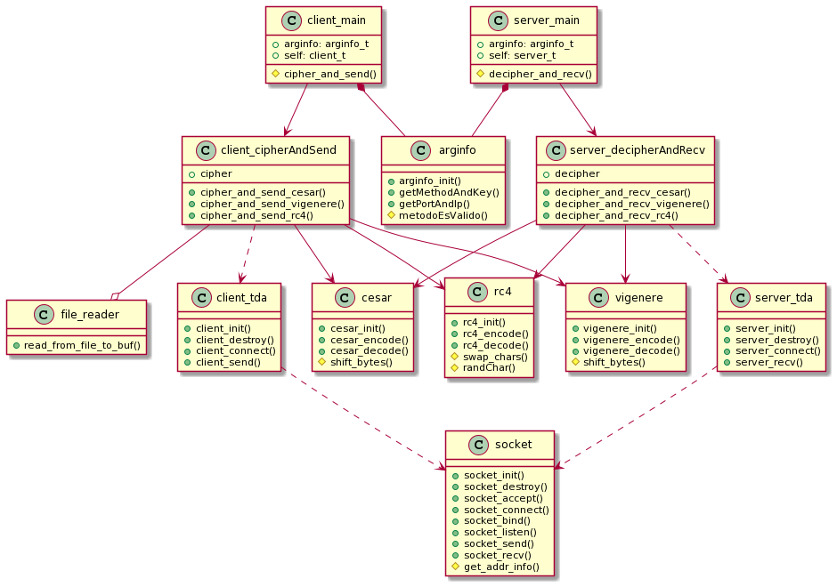
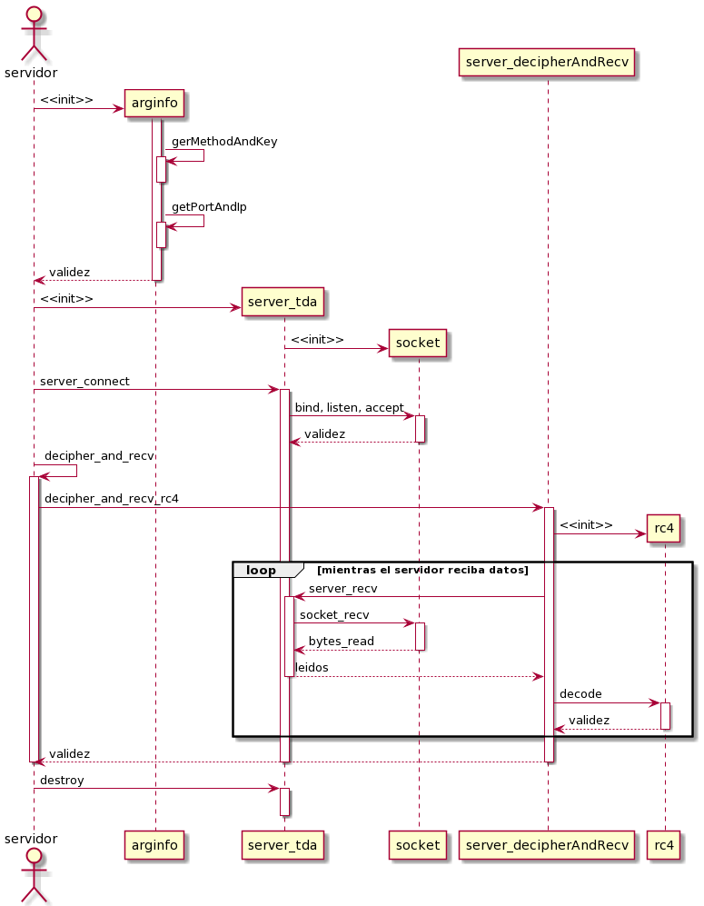
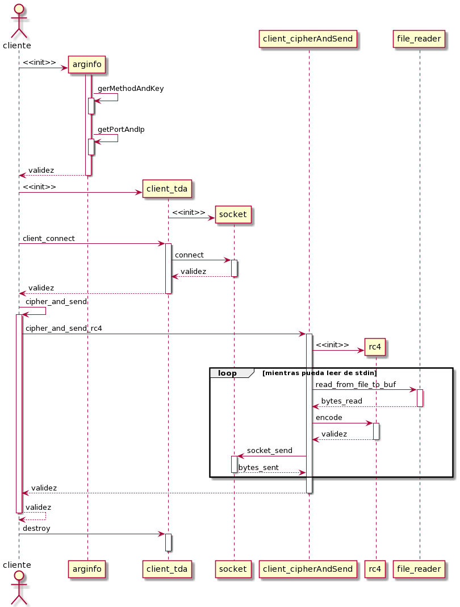

# Taller de Programación I - Cátedra Veiga - FIUBA
# Trabajo Práctico I 

<h2 align="right">Jonathan David Rosenblatt</h2>
<h2 align="right">104105</h2>

## Introducción

Este es el primer trabajo práctico de la materia en el que se debe entregar un producto programado y documentado. El mismo fue programado en C y requiere conocimientos introductorios en redes y criptografía. Un objetivo de este tp es nivelar la capacidad de programación en C del alumnado, adquiriendo buenas prácticas y escribiendo buen código en el camino.

## Configuración del Proyecto

Para configurar y ejecutar el código lo primero que se debe hacer es clonar el repositorio. Luego para compilar y enlazar se debe ejecutar el Makefile incluido (ejecutando ```make```). En caso de tener errores con el compilador o el enlazador se verán escritos por stderr.

Primero se debe ejecutar el servidor:

```
./server <SERVER-PORT> --method=<METHOD> --key=<KEY>
```

Y luego el cliente:

```
./client <SERVER-HOST> <SERVER-PORT> --method=<METHOD> --key=<KEY>
```

Siendo:

- ```<SERVER_HOST>```: La dirección IPV4 de la persona ejecutando el servidor.
- ```<SERVER-PORT>```: El puerto que el servidor utilizará para comunicarse con el cliente.
- ```<METHOD>```: Método con el que se va a encriptar (caso cliente) y desencriptar el mensaje (caso servidor).
- ```<KEY>```: Llave con la que se va a encriptar y desencriptar el mensaje. 

Aclaración: el mensaje que reciba el servidor tendrá sentido solo si el método y clave ingresados en ambas puntas coinciden. Pueden ingresarse valores diferentes pero la llegada muy probablemente no tenga ningún sentido.

## Diseño, Redes y Cifrado

El proyecto tiene varios archivos y cada uno de ellos representa y abstrae las diferentes funcionalidades que se necesitan para que funcionen en conjunto. Las clases que terminan con ```"_main.c"``` son el esqueleto del proyecto, llaman a todas las otras funciones y verifican los outputs de todas.

Luego están las funciones ```client_cipherAndSend``` y ```server_decipherAndRecv``` que llaman y verifican lo que hacen los encriptadores, los sockets (encapsulados por los tdas ```client_tda``` y ```server_tda```) y el lector de archivos en el caso del cliente. Estos le proveen a los ```_main``` una buena abstracción de como cada cifrador opera, de como se lee del stdin y de como operan los sockets.

Finalmente están las 3 clases encriptadoras y el socket. La implementación de los ```client_tda``` y ```server_tda``` abstraen la implementación del socket.

Todos estos archivos, además de encapsular, permiten generar código reutilizable para otros proyectos.

<br><p align="center"></p> 

***El software utilizado para realizar los diagramas, plantuml, interpreta los elementos ingresados como clases, pero en C no hay clases.***

En el siguiente diagrama de secuencia se aprecia el flujo del programa cuando desde el servidor se quiere desencriptar lo que se recibe por red. Se ve que la capa más alta de abstracción, es decir el servidor, solamente hace algunas llamadas y no se encarga de trabajar los datos, ya que todas esas responsabilidades se las delega a las entidades de más baja abstracción.

Vemos que el servidor le pide a su TDA que se conecte con el cliente, sin saber que el mismo hace varias llamadas al socket para lograr su cometido. 

Luego de establecer una conexión el servidor le delega a otra entidad el descifrado de los datos que llegan por red, y una vez más vemos como el servidor no se tiene que preocupar de como desciframos o pedimos los datos. 

El server_decipherAndRecv a su vez le delega al server_tda que busque los datos y descifra todo siempre que el socket, encapsulado por el server_tda, pueda recibir datos.

Finalmente el servidor libera todos los recursos utilizados.

<br><p align="center"></p> 

Desde el lado del cliente la lógica es muy parecida y casi simétrica con la del servidor. Solamente cambian las operaciones que se realizan dentro del ciclo, pero una vez más, todo está bien encapsulado y segmentado en diferentes archivos que representan las varias capas de abstracción necesarias.

<br><p align="center"></p> 

## Herramientas Utilizadas

Las herramientas más utilizadas en este tp fueron:

- ***Valgrind***: el glorioso programa que tanto nos ayuda a debuggear el código. Con flags como ```--track-origins=yes``` para ver donde se nos generan variables no inicializadas que puedan causar problemas y ```--track-fds=yes``` para ver si nos quedaron sockets sin liberar (y donde fueron creados en caso de ser necesario). 

- ***Gdb***: el debugger de GNU, súper útil para revisar con detalle el código y encontrar más facilmente la causa de problemas como segmentation faults, loops infinitos, entre otros.

- ***Tiburoncín***: un software muy bueno para verificar como los datos se mandan del cliente al servidor. De especial utilidad para verificar que lo que sale del cliente llega como debería al servidor.

## Conclusión

Este tp resultó ser bastante exigente y personalmente tuve que dedicarle muchas horas de trabajo.

La parte de criptografía requiere un inmenso cuidado a la hora de escribir y testear el código. Lo mismo ocurre con la parte de redes, donde uno debe sentarse a leer la extensa documentación involucrada en todas las funciones que debemos utilizar.

Como dije en la introducción y en otras partes del trabajo, se aprenden muchas cosas súper interesantes y útiles como el manejo inteligente del stack en C, criptografía básica, conocimientos de redes, prácticas desarrollando TDA's, etc.
