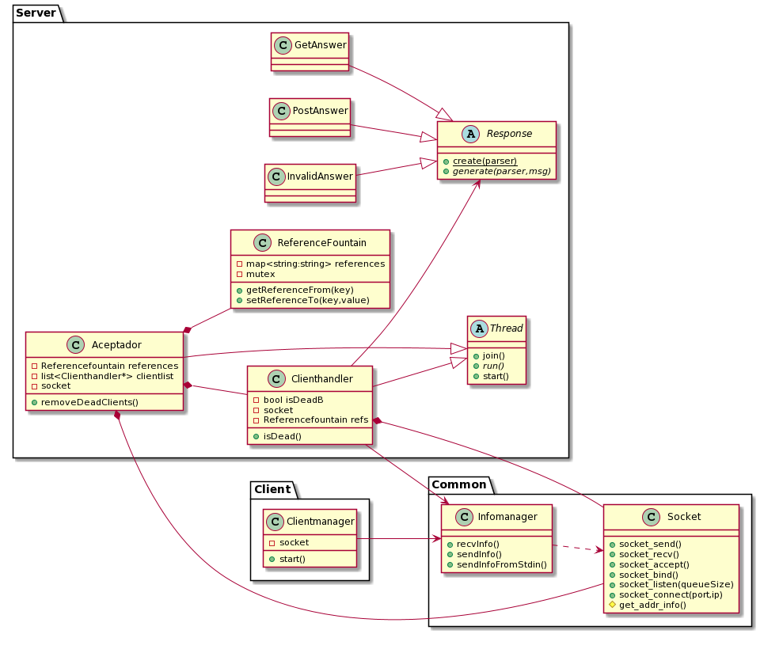
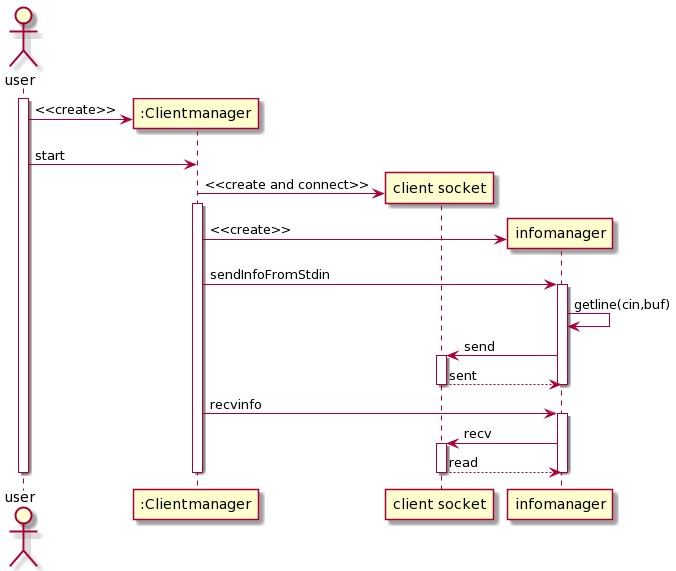
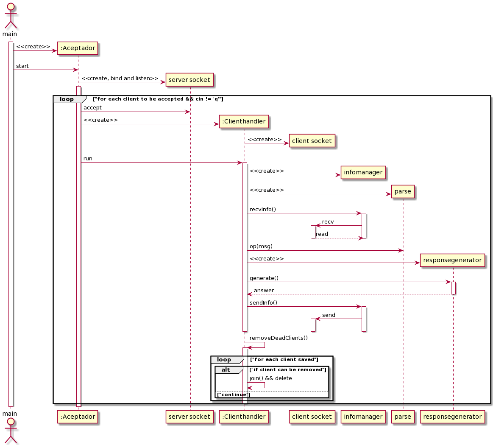

# Taller de Programación I - Cátedra Veiga - FIUBA
# Trabajo Práctico III 

<h2 align="right">Jonathan David Rosenblatt</h2>
<h2 align="right">104105</h2>

Introducción

Este es el tercer trabajo práctico de la materia en el que se debe entregar un producto programado y documentado. El mismo fue programado en C++ y requiere conocimientos en este lenguaje, además de conocimientos en la programación multi-hilos para implementar un sistema cliente-servidor. Este implementa, de forma reducida, un sistema cliente-servidor de gestión de petitorios HTTP. Aquí cada petitorio que recibe el servidor desde algún cliente sea procesado por un hilo en particular. Esto nos da un boost en eficiencia temporal gracias a la concurrencia.

## Configuración del Proyecto

Para configurar y ejecutar el código lo primero que se debe hacer es clonar el repositorio. Luego para compilar y enlazar se debe ejecutar el Makefile incluido (ejecutando ```make```). En caso de tener errores con el compilador o el enlazador se verán escritos por stderr.

Se debe ejecutar el servidor con:  

```
./server <PORT> <ROOTFILE>
```

Y el cliente con:

```
./client <IP> <PORT>
```

Siendo:

- ```<IP>```: La IPV4 del servidor al cual nos queremos conectar ***desde el lado del cliente***.
- ```<PORT>```: El puerto designado para conectarse.
- ```<ROOTFILE>```: El archivo raíz que leerá el cliente para responder a los petitorios.

***Se pueden ejecutar varios clientes y estos serán atendidos en paralelo, gracias a nuestra implementación que permite generar respuestas de forma concurrente como consecuencia del uso de Threads.***

## Diseño y Clases

Este sistema está compuesto por varias clases. Primero está _Response_, el cual puede generar el tipo de respuesta correspondiente en función de la información parseada y devolver una referencia al mismo. Está clase posee un método abstracto cuyas hijas implementarán como necesiten para generar la respuesta correspondiente en función de la situación. 

Luego está la clase _ReferenceFountain_ que es, basicamente, un diccionario thread-safe. Útil para ser manipulado por varios hilos de forma concurrente sin generar condiciones de carrera.

La clase que interactua con esta, es el _ClientHandler_. El mismo posee el socket antes aceptado por el socket del server y puede comunicar cuando terminó de ejecutarse (útil para remover las instancias que ya no estén operando).

La clase _Infomanager_ funciona como un wrapper del socket y facilita el pasaje de información por el mismo. Es utilizado por el cliente y servidor.

Finalmente la última clase importante es _Aceptador_. Esta contiene la lógica principal del programa desde el lado del servidor. Mientras vive procesa clientes entrantes, elimina los ya procesados y al ser eliminado (es decir, cuando el main recibe una 'q' por stdin) libera todos los recursos que este necesitó, una vez termina de ejecutar lo que ya tenía designado. El uso de un hilo aquí permite que el server pueda delegarle la responsabilidad de manipular la información, mientras este solo espera que llegue el input que mate al programa.

<br><p align="center"></p> 

Desde el lado del cliente, vemos como lo único que hace es crear su socket y usar el _infomanager_ para enviar y recibir datos. Finalmente se liberan todos los recursos.

<br><p align="center"></p> 

En cambio vemos que el servidor se ejecutan muchas más operaciones. Consecuencia obvia de la amplia cantidad de clases que tenemos en ```/server_src```. Este posee su propio socket principal que hace el el bind para reservar un puerto, un listen para escuchar conexiones entrantes y un accept para admitirlas. Luego la instancia de Clienthandler le pide a la instancia de Infomanager que reciba la información con el socket nuevo, la parsea, genera una respuesta de forma polimórfica y la envía. Todo esto ocurre en hilos que trabajan de forma concurrente, mientras que el Aceptador va destruyendo los hilos que ya no están operando. Finalmente se liberan todos los recursos.

<br><p align="center"></p> 

## Herramientas Utilizadas

Las herramientas más utilizadas en este tp fueron:

- ***Valgrind***: el glorioso programa que tanto nos ayuda a debuggear el código. Con flags como ```--track-origins=yes``` para ver donde se nos generan variables no inicializadas que puedan causar problemas; ```--leak-check=full``` para detectar donde se generan variables no inicializadas; y ```--track-fds=yes``` para verificar que no estamos dejando ningún fd abierto de más; entre otros.

- ***Gdb***: el debugger de GNU, súper útil para revisar con detalle el código y encontrar más facilmente la causa de problemas como segmentation faults, loops infinitos, entre otros.

- ***Tiburoncín***: herramienta desarrollada por la cátedra. Muy útil para rastrear el paso de los datos de cliente a servidor y viceversa. Nos permite potencialmente discernir si un problema viene del lado del servidor o del cliente.
